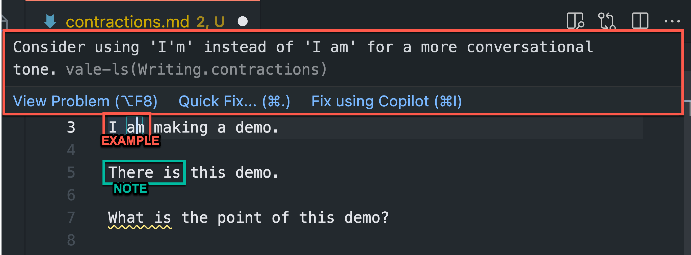

# Doc Linting

I'm demonstrating doc linting for style and code. For linting, I'm using:

- [Vale](https://vale.sh) for style checking
- [Super-Linter](https://github.com/marketplace/actions/super-linter) for code checking

## Why?

For style, uniform content across an organization is helpful for users. When the content is uniform, the user has less cognitive load and less context switching. Also, the automation makes writers more efficient with less manual intervention or editing.

For code, I want to ensure enforcement of standards and best practices. For instance, I might use packages with a particular nuance for Markdown or a plugin that does something non-standard with YAML. So, I want to customize a tool like Super-Linter to find what I want it to find and ignore what I want it to ignore. Again, the automation helps with efficiency and reducing troubleshooting and downstream errors.

## Style Linting With Vale

I can have a style checking strategy for content:

- on my local machine only
- on my local machine and in the CI/CD pipeline
- in the CI/CD pipeline only

### On My Local Machine

I can use Vale CLI or I can incorporate a Vale plugin into my editor. For this demo, I am using the Vale extension for VS Code; however, other editors like the Oxygen XML Editor have a [Vale addon](https://www.oxygenxml.com/addons/com.oxygenxml.vale.plugin.html).

### In the CI/CD Pipeline

I can setup a `vale.yml` to work with GitHub Actions or GitLab CI/CD or Jenkins.

### Example Rule

I want to maintain a conversational style. One aspect of a conversational style is using contractions. Here's a draft of that rule:

```yaml
#contractions.yml

extends: substitution
message: "Consider using '%s' instead of '%s' for a more conversational tone."
level: warning
ignorecase: true
swap:
  '(?<!([Ii]f|[Ww]hen|[Ww]here|[Ww]hat|[Ww]hy|[Hh]ow|[Tt]here)) is not\b': "'s not"
  'are not\b': "aren't"
  'cannot\b': "can't"
  'could not\b': "couldn't"
  'did not\b': "didn't"
  'does not\b': "doesn't"
  'do not\b': "don't"
  'had not\b': "hadn't"
  'has not\b': "hasn't"
  'have not\b': "haven't"
  'I am\b': "I'm"
  'is not\b': "isn't"
  'it is\b': "it's"
  'must not\b': "mustn't"
  'shall not\b': "shan't"
  'should not\b': "shouldn't"
  'that is\b': "that's"
  'they are\b': "they're"
  'was not\b': "wasn't"
  'were not\b': "weren't"
  'what is\b': "what's"
  'will not\b': "won't"
  'would not\b': "wouldn't"
  'you are\b': "you're"
  'you have\b': "you've"
  'there is\b': "there's"
```

### Demo



In the example, I hover over 'I am' since it's underlined in yellow, and the suggestion is available.

In the note, another contraction, 'There is' isn't underlined at all. This is a gap in rule that I can address with some regex.

```yaml
'there is\b': "there's"
```

## Code Linting With Super-Linter

TODO
